# ⛉ AL HERO - All-in-One Toolkit for Business Central

> **AL Hero** is an all-in-one productivity toolkit for Microsoft Dynamics 365 Business Central AL developers. Build faster with project dashboards, project symbol browsing, AL object generation, JSON-to-AL conversion, API exploration, translation management, schema visualization, dependency analysis, and legacy C/AL migration—all from within Visual Studio Code.

---

## Table of Contents

- [Features Overview](#features-overview)
- [Commands Reference](#commands-reference)
- [Dashboard](#1-dashboard)
- [Browse Project Symbols](#2-browse-project-symbols)
- [Quick Project Setup](#3-quick-project-setup)
- [AL Object Creator](#4-al-object-creator)
- [JSON → AL Generator](#5-json--al-generator)
- [API Explorer](#6-api-explorer)
- [Translation Assistant](#7-translation-assistant)
- [Schema Viewer](#8-schema-viewer)
- [Dependency Graph](#9-dependency-graph)
- [Legacy Object Converter](#10-legacy-object-converter)
- [Getting Started](#getting-started)
- [Tips & Shortcuts](#tips--shortcuts)

---

## Features Overview

| Tool | Command | Description |
|---|---|---|
| 🧭 Dashboard | `AL HERO: Open Dashboard` | Your project's central hub — overview, stats, quick actions, and one-click BC commands |
| 🔍 Browse Project Symbols | `AL HERO: Browse Project Symbols` | Instantly search and navigate every AL object in your workspace |
| 🗂️ Quick Project Setup | `AL HERO: Open Quick Project Setup` | Scaffold a standard AL folder structure in seconds |
| 🧱 AL Object Creator | `AL HERO: Open AL Object Creator` | Generate AL objects with a guided form and batch queue |
| 🔄 JSON → AL Generator | `AL HERO: Open JSON2AL Generator` | Turn any JSON payload into ready-to-use AL code |
| 🔌 API Explorer | `AL HERO: Open API Explorer` | Browse, test, and inspect your BC API endpoints live |
| 🌍 Translation Assistant | `AL HERO: Open Translation Assistant` | Manage XLIFF translation files with a visual editor |
| 🗄️ Schema Viewer | `AL HERO: Open Schema Viewer` | Explore table schemas, fields, keys, and relationships |
| 🕸️ Dependency Graph | `AL HERO: Open Dependency Graph` | Visualise object dependencies across your workspace |
| 🏗️ Legacy Object Converter | `AL HERO: Open Legacy Object Converter` | Migrate exported NAV C/AL objects into Business Central AL, edited and saved like any normal VS Code file |

---

# 1. Dashboard

The **Dashboard** is the central hub of AL Hero and serves as the default landing page for the extension. It provides a live overview of your workspace, key project information, and one-click access to every AL Hero tool.

> **Note:** The Dashboard is available **only** through the **AL Hero Activity Bar**. It is the root view of the extension and **cannot be opened from the Command Palette by design**.

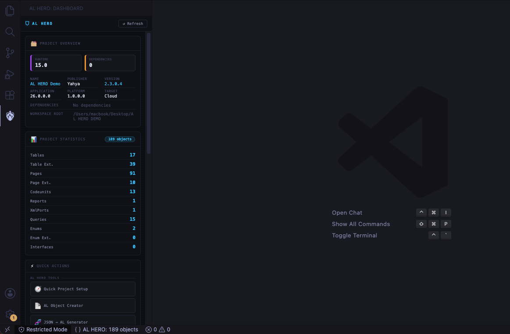

## How to Use

1. Click the **AL Hero** icon in the Visual Studio Code **Activity Bar**.
2. The **Dashboard** opens automatically as the main AL Hero view.
3. Review the **Workspace Overview** card to see your detected `app.json` information, including the app name, publisher, version, target, and workspace root.
4. View **Project Statistics** for live counts of tables, pages, codeunits, reports, and other AL objects.
5. Use **Quick Actions** to launch any AL Hero feature with a single click.
6. Run common **Business Central** operations, such as downloading symbols, publishing to a sandbox, or packaging your extension, directly from the Dashboard.

## Features at a Glance

* **Default AL Hero landing page** — opens from the Activity Bar as the extension's main view.
* **Workspace overview** — displays your active project's identity and location.
* **Project information** — surfaces important `app.json` metadata.
* **Project statistics** — live object counts across your workspace.
* **Quick Actions** — one-click access to all AL Hero tools.
* **Business Central commands** — execute common development tasks directly from the Dashboard.

---

## 2. Browse Project Symbols

**Command:** `AL HERO: Browse Project Symbols`

A fast, searchable workspace explorer that lets you browse every AL object in the current project — including objects pulled in from referenced symbol packages — without digging through folders in the VS Code Explorer.

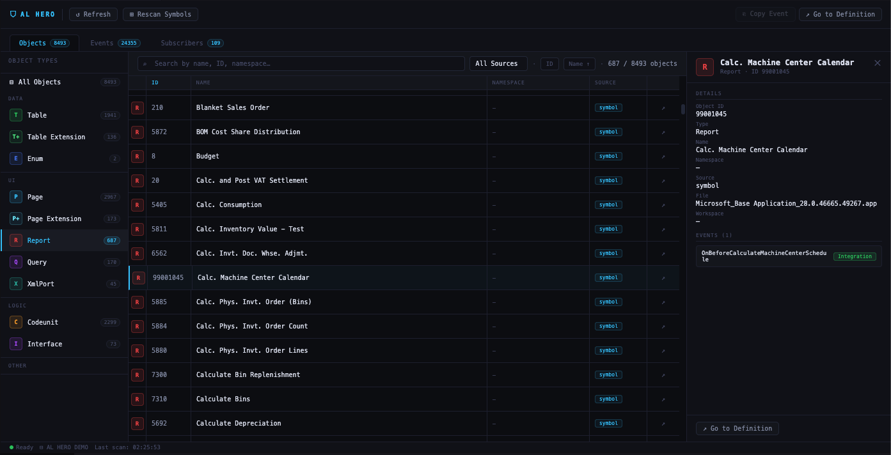

### How to Use

1. Open the panel via the Command Palette.
2. AL Hero automatically **scans the workspace** (and linked symbol packages) and lists every detected object.
3. Use the **search bar** to instantly filter objects by name, ID, or type as you type.
4. Use the **Type filter** to narrow the list down to a specific object type (Table, Page, Codeunit, Report, Enum, and more).
5. Click any object in the list to preview its key details — ID, type, and source location.
6. Click **↗ Open Source** to jump straight to the object's `.al` file, or to the relevant symbol reference if it originates from a dependency.

### Features at a Glance

- **Instant search** — filter thousands of objects in real time as you type.
- **Type filtering** — narrow results down to a single object type at a time.
- **Object navigation** — jump between results without losing your place.
- **Workspace scanning** — automatically picks up new objects as your project grows; rescan on demand to refresh results.
- **Open source directly** — one click takes you from the symbol list straight to the underlying AL code.

---

## 3. Quick Project Setup

**Command:** `AL HERO: Open Quick Project Setup`

Instantly scaffold a clean, professional AL project folder structure without leaving VS Code. Instead of manually creating directories, select the components your project needs and AL HERO creates them all in one click.

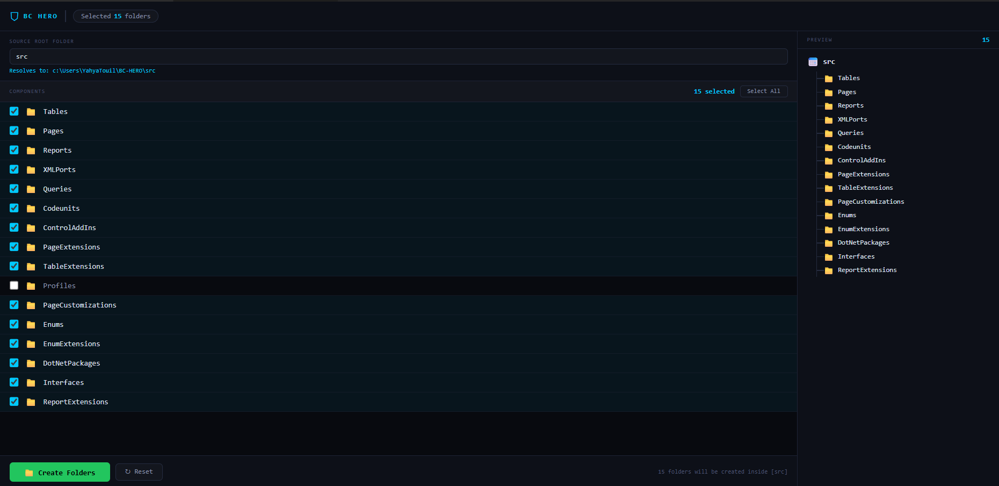

### How to Use

1. Open the panel via the Command Palette.
2. Set the **Source Root Folder** — the base folder where all subdirectories will be created (e.g. `src`). The resolved path is shown in real time beneath the input.
3. From the component list, **check the folders** you need. Use **Select All** to enable every component, or tick them individually.
4. Watch the **live preview tree** on the right update as you make selections — you always know exactly what will be created before committing.
5. Click **Create Folders** to generate the structure. A results panel confirms each folder created.

### Available Components

AL HERO can scaffold any combination of the following standard AL folders:

`Tables` · `Pages` · `Reports` · `XMLPorts` · `Queries` · `Codeunits` · `ControlAddIns` · `PageExtensions` · `TableExtensions` · `Profiles` · `PageCustomizations` · `Enums` · `EnumExtensions` · `DotNetPackages` · `Interfaces` · `ReportExtensions`

### Features at a Glance

- **Live preview tree** — see the resulting folder structure before creating anything.
- **Resolved path hint** — the full absolute path to your source root is shown dynamically as you type.
- **Batch creation** — all selected folders are created in a single operation.
- **Reset** — clears all selections and restores defaults instantly.

---

## 4. AL Object Creator

**Command:** `AL HERO: Open AL Object Creator`

A guided, form-based wizard for generating AL object files. Configure each object's type, ID, name, fields, and destination — then queue multiple objects and create them all at once.

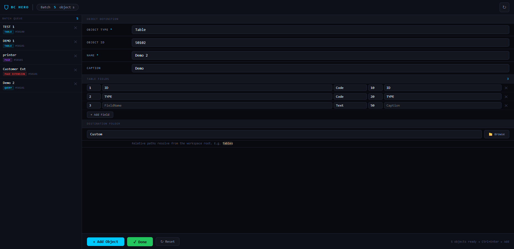

### How to Use

1. Open the panel and select an **Object Type** from the dropdown (16 types supported).
2. Fill in the common fields:
   - **Object ID** — auto-suggested based on the highest existing ID in your workspace for the chosen type.
   - **Name** — the AL object name.
   - **Caption** — defaults to the name if left blank.
3. Fill in the **type-specific fields** that appear below (e.g. fields for a Table, source table for a Page, values for an Enum).
4. Set the **Destination Folder** where the `.al` file should be saved. Click **Browse** to pick a folder visually.
5. Click **+ Add Object** (or press `Ctrl+Enter`) to add the object to the **Batch Queue** on the left.
6. Repeat for additional objects. Each queued item shows its name, type badge, and assigned ID.
7. Click **✓ Done** to create all queued objects at once. A results panel lists every file created.

### Supported Object Types

| Type | Details |
|---|---|
| Table | Fields, data types, lengths, captions |
| Page | Page type (Card, List, API…), source table, layout fields |
| Report | Data item, columns, request page toggle |
| XML Port | Direction, format, source table, field names |
| Query | Normal or API query, data items, columns |
| Codeunit | Single-instance toggle, procedure stubs |
| Control Add-in | Scripts, stylesheets, dimensions |
| Page Extension | Extends an existing page, adds fields and actions |
| Table Extension | Extends an existing table, adds fields |
| Profile | Profile ID, role center, enabled/promoted flags |
| Page Customization | Customizes an existing page |
| Enum | Values with IDs and captions, extensible flag |
| Enum Extension | Extends an existing enum with new values |
| .NET Package | Assembly, version, culture, public key, type aliases |
| Interface | Procedure signatures |
| Report Extension | Extends an existing report with columns |

### Features at a Glance

- **Smart ID suggestion** — the Object ID field is automatically pre-filled with the next available ID for the selected type, accounting for both existing workspace objects and objects already in the batch queue.
- **Batch queue** — build a list of objects before generating, then create them all in one go.
- **Per-item removal** — click the ✕ on any queued item to remove it without clearing the rest.
- **Rescan IDs** — click the refresh icon in the toolbar to re-scan the workspace for the latest used object IDs.
- **`Ctrl+Enter` shortcut** — adds the current form state to the queue without reaching for the mouse.

---

## 5. JSON → AL Generator

**Command:** `AL HERO: Open JSON2AL Generator`

Drop any JSON file onto AL HERO and receive fully structured AL code — tables, pages, or XMLports — with fields, types, and captions inferred automatically from the JSON data.

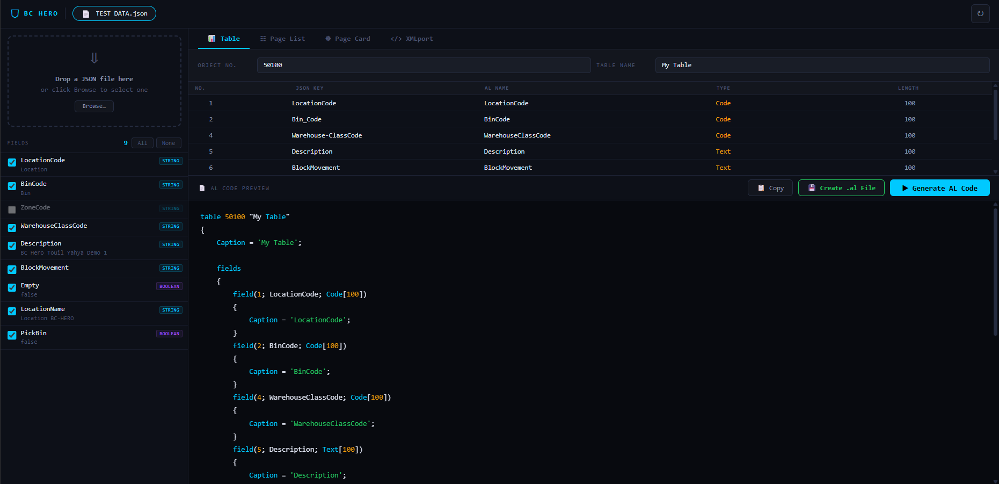

### How to Use

1. Open the panel. The left side shows a **drop zone**.
2. **Drag and drop** a `.json` file onto the drop zone, or click **Browse** to select one. OData responses (`{ "value": [...] }`) and plain JSON arrays or objects are all supported.
3. AL HERO analyses the JSON and lists all detected **fields** in the left panel, showing each field's inferred AL type and a sample value from the data.
4. Use the checkboxes to **select or deselect** individual fields. Use **All** / **None** buttons to toggle everything at once.
5. Choose an **object type** from the tabs along the top: **Table**, **Page List**, **Page Card**, or **XMLport**.
6. Fill in the **configuration panel** (object number, name, source table, etc.) for the chosen type.
7. In the **field configuration table**, fine-tune each field: edit the AL name, change the data type, and adjust the length for `Text` or `Code` fields.
8. Click **▶ Generate AL Code**. The right panel displays syntax-highlighted AL code ready to use.
9. Click **Copy** to copy the code to your clipboard, or **Create .al File** to save it directly into a selected folder in your workspace.

### Field Type Inference

AL HERO maps JSON value types to sensible AL defaults:

| JSON Type | Default AL Type |
|---|---|
| String | `Text[100]` |
| Number | `Decimal` or `Integer` |
| Boolean | `Boolean` |
| Null | `Text[100]` |
| Object / Array | `Text[250]` |

All inferred types can be overridden in the field configuration table before generating.

### Features at a Glance

- **Drag-and-drop** JSON loading — works anywhere on the window.
- **OData support** — automatically unwraps `{ "value": [...] }` response envelopes.
- **Live AL syntax highlighting** — keywords, strings, numbers, and comments are colour-coded in the preview pane.
- **Per-field customisation** — rename fields, change types, and adjust lengths without editing the generated code.
- **Direct file creation** — generates a `.al` file with a sensible suggested filename.

---

## 6. API Explorer

**Command:** `AL HERO: Open API Explorer`

A full-featured HTTP client built specifically for Business Central APIs. Browse API endpoints discovered in your workspace, configure authentication, build requests with query parameters, and inspect responses — all inside VS Code.

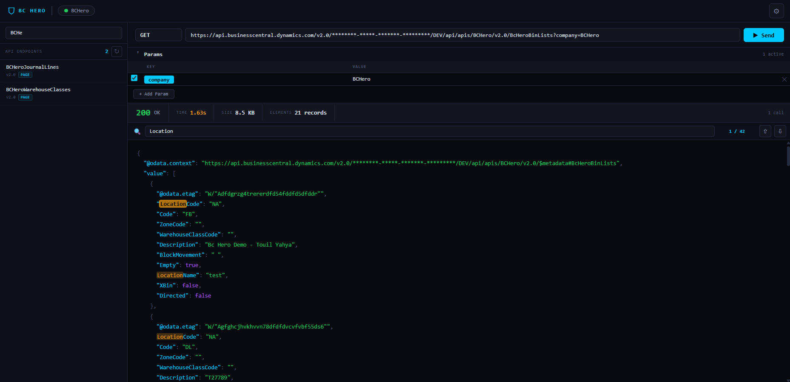

 

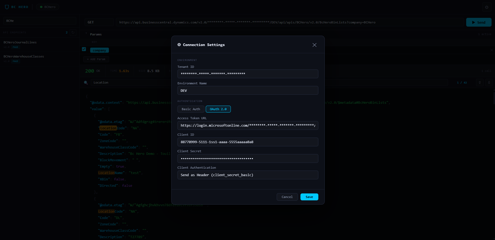

### How to Use

#### Connect to Your Environment

1. Click the **connection pill** (top-left) or the **⚙ gear icon** to open **Connection Settings**.
2. Enter your **Tenant ID** and **Environment Name**.
3. Choose an authentication method:
   - **Basic Auth** — username and password.
   - **OAuth 2.0** — access token URL, client ID, client secret, and client authentication method (`client_secret_post` or `client_secret_basic`).
4. Click **Save**. The connection pill turns green and shows the environment name when connected.

#### Browse & Send Requests

1. The **left panel** lists all API endpoints found in your workspace — pages with `PageType = API` and queries with `QueryType = API`. Use the search bar to filter by name.
2. Click an endpoint to load its URL into the request bar. The `company` query parameter is automatically injected if a company name is available.
3. Select an HTTP **method** (`GET`, `POST`, `PUT`, `PATCH`, `DELETE`) and adjust the URL if needed.
4. Use the **Params** accordion to manage query parameters:
   - Check or uncheck rows to include or exclude individual parameters.
   - The URL bar stays in sync with the params table at all times.
   - The `company` parameter is highlighted with a special accent pill.
5. Click **▶ Send** (or press `Ctrl+Enter`) to fire the request.

#### Inspect the Response

The response area shows:
- **Status code** and status text (colour-coded: green for 2xx, amber for 3xx, red for errors).
- **Response time** (colour-coded by speed: green < 500 ms, amber < 2 s, red ≥ 2 s).
- **Response size** in bytes, KB, or MB.
- **Element count** — items in an array, records in a `value` property, or keys in an object.
- **Call counter** — total requests made in the current session.
- A **syntax-highlighted JSON viewer** with colour-coded keys, strings, numbers, booleans, and null values.

#### Search Within the Response

Once a JSON response is loaded, a **search bar** appears above the response body:
- Type to highlight all matching text across the entire JSON.
- A match counter shows the current position (e.g. `3 / 14`).
- Use the **▲ / ▼ navigation buttons** to jump between matches. The active match is scrolled into view automatically.

### Features at a Glance

- **Workspace endpoint discovery** — automatically scans for AL API pages and queries; click **⟳ Rescan** to refresh after code changes.
- **Params ↔ URL sync** — editing either the URL bar or the params table keeps both in sync; no risk of duplicate or malformed query strings.
- **Session persistence** — performance history (up to 30 calls) is preserved for the session.
- **Ctrl+Enter shortcut** — sends the current request without leaving the keyboard.

---

## 7. Translation Assistant

**Command:** `AL HERO: Open Translation Assistant`

A visual XLIFF editor for managing Business Central translation files. View progress across all locales, edit translations inline, validate quality, and save changes — all without leaving VS Code.

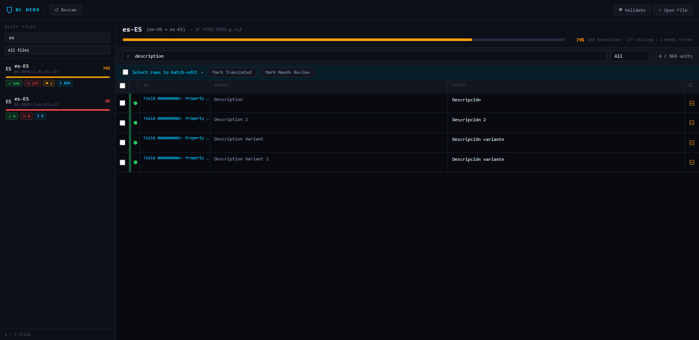

### How to Use

#### Select a Translation File

1. Open the panel. AL HERO scans your workspace for XLIFF files (`.xlf`) in a `Translations` folder.
2. The **left panel** lists all files found, each showing:
   - A **language flag** and locale code.
   - A **progress bar** and percentage showing how many strings are translated.
   - Counts for translated ✓, missing ✕, and needs-review ⚑ strings.
3. Use the **search bar** and **status filter** to narrow the list (e.g. show only incomplete files).
4. Click a file to load it in the right panel.

#### Edit Translations

1. The right panel shows all translation units in a table with columns for **ID**, **Source** (original English text), and **Target** (the translation).
2. Click any **Target** cell to open an inline editor. Type the translation directly.
3. Use the **state selector** (Translated, Needs Review, Final, etc.) to set the unit's state.
4. Changes are **saved automatically** — on blur (immediately when you leave the cell) and while typing (after a short delay). No Save button is needed.
5. Press `Escape` to discard changes and revert to the previous value.

#### Filter & Navigate

- Use the **search bar** in the toolbar to filter units by source text, target, ID, or notes.
- Use the **status filter** dropdown to show only Translated, Untranslated, or Needs Review units.
- The **unit counter** always shows how many units match the current filter.

#### Batch Operations

- Check individual rows using the checkboxes on the left, or use the **header checkbox** to select/deselect all visible units.
- With units selected, use the **batch bar** at the top to mark all selected units as **Translated** or **Needs Review** in one action.

#### Notes

- Click the **⊟ note icon** on any row to open a flyout showing developer notes and AL HERO notes attached to that translation unit.
- Notes are read-only and help you understand the context of each string.

#### Validation

- Click **⚑ Validate** in the toolbar to run quality checks on the current file.
- Detected issues (missing translations, source-identical targets, placeholder mismatches) appear in a panel at the bottom.
- Click any validation issue to jump directly to the offending unit in the table.

### Features at a Glance

- **Auto-save** — translations are persisted automatically as you type; no manual save step.
- **Progress tracking** — a header progress bar shows the overall completion percentage for the selected file with colour coding (green ≥ 90 %, amber ≥ 50 %, red < 50 %).
- **Open in editor** — click **↗ Open File** to open the raw XLIFF file in VS Code's text editor.
- **Rescan** — click **↺ Rescan** to pick up newly added translation files without reloading the panel.

---

## 8. Schema Viewer

**Command:** `AL HERO: Open Schema Viewer`

Explore Business Central table schemas visually. Browse tables, inspect every field's type and metadata, view keys and indexes, and understand relationships through an interactive force-directed graph.

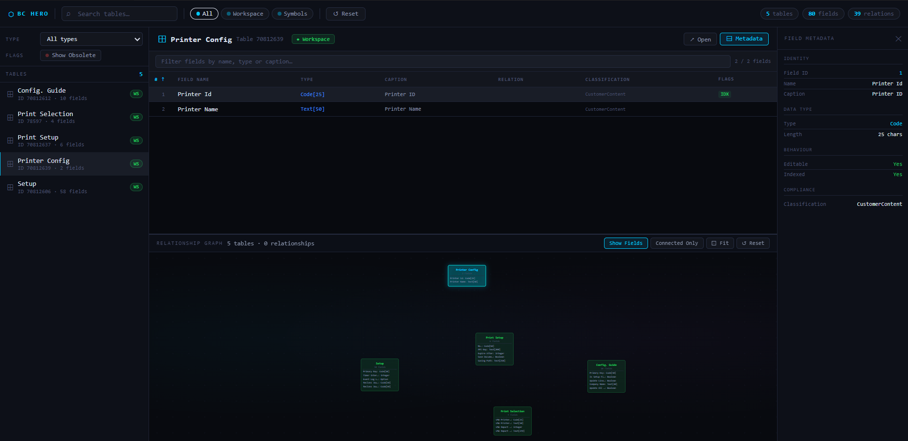

### How to Use

#### Browse Tables

1. Open the panel. All tables detected in your workspace (and linked symbol packages) are listed in the **left panel**.
2. Use the **search bar** in the top toolbar to filter by table name or caption.
3. Use the **Type filter** to show only tables of a specific type (Normal, Temporary, CRM, ExternalSQL).
4. Toggle **Show Obsolete** to include or exclude tables marked obsolete.
5. Click any table to open it in the **detail pane**.

#### Inspect Fields

The detail pane opens with a full field table showing:

| Column | Description |
|---|---|
| # | Field ID |
| Field Name | The AL field name (highlighted if search is active) |
| Type | Data type and length (e.g. `Text[50]`, `Decimal`) |
| Caption | The field's display caption |
| Relation | The related table (shown as `→ TableName`) |
| Classification | Data classification (e.g. CustomerContent, SystemMetadata) |
| Flags | `IDX` (indexed), `RO` (read-only), `Obs` (obsolete) |

- Click any **column header** to sort the field table by that column. Click again to reverse.
- Use the **field search bar** to filter fields by name, type, or caption within the selected table.
- Click any **field row** to open the **Metadata Sidebar** with full details: field ID, data type, length, option values, editability, index status, table relation, data classification, and obsolete state.

#### View Keys

Click **⊟ Keys** in the detail header to expand a panel showing all table keys and indexes, including which fields each key covers and whether it is the primary (clustered) key or a unique index.

#### Relationship Graph

The lower half of the right panel shows an interactive **force-directed relationship graph**:
- Each table is a node. Arrows represent `TableRelation` dependencies.
- **Click a node** to highlight it and dim all unrelated tables and edges. Click the same node again or click the background to clear the highlight.
- **Drag nodes** to rearrange the layout. Zoom with the scroll wheel or trackpad.
- Use **Show Fields** to display the first 5 field names inside each node.
- Use **Connected Only** to hide tables with no relationships.
- Use **⊡ Fit** to zoom the graph to fit all visible nodes in the viewport.
- Click **⊟ Details** to collapse the detail pane and give the graph more space.

### Features at a Glance

- **↗ Open** — click the Open button in the detail header to jump directly to the table's `.al` source file.
- **Stats bar** — the top toolbar always shows the total number of tables, fields, and relationships in the current schema.
- **Reset** — clears all filters and search terms and restores the default view.

---

## 9. Dependency Graph

**Command:** `AL HERO: Open Dependency Graph`

A full-workspace, interactive dependency map showing how your AL objects relate to one another. See which pages extend which tables, which codeunits subscribe to which events, and how every object fits into the larger picture.

 

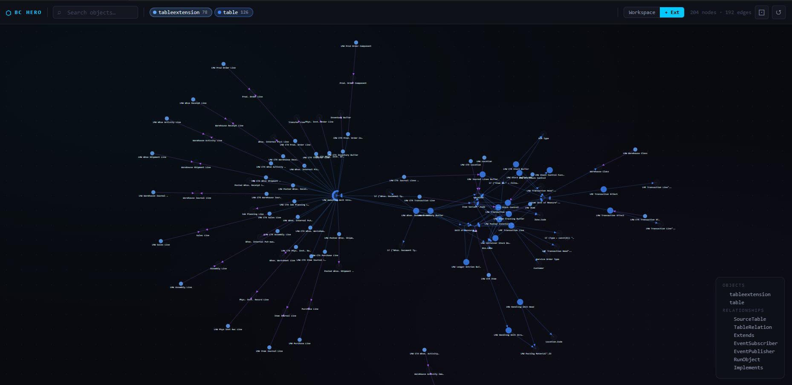

### How to Use

1. Open the panel. AL HERO scans the workspace and builds the graph automatically.
2. The graph renders all objects as **colour-coded nodes** grouped by object type, with directed edges representing dependencies.
3. **Click a node** to focus it — its direct connections are highlighted and everything else is dimmed. Click the same node or the background to clear.
4. **Drag nodes** to reorganise the layout. Pan by dragging the background. Zoom with the scroll wheel.
5. **Right-click a node** to open a context menu with options to open the source file, focus connections, or copy the object name or ID.
6. **Hover over a node** to see a tooltip with the object type, ID, file path, and any obsolete or external flags.

### Filtering & Navigation

- **Search bar** — type to dim all nodes that don't match, revealing only matching objects and their immediate neighbours.
- **Type chips** — toggle individual object types (Table, Page, Codeunit, Report, Enum, etc.) on and off to reduce visual clutter. Each type has a distinct colour.
- **Scope toggle** — switch between **Workspace** (your own objects only) and **+ Ext** (includes external/symbol dependencies) to control how much of the graph is shown.

### Relationship Types

Edges are colour-coded by the kind of dependency they represent:

| Colour | Relationship |
|---|---|
| 🟢 Green | SourceTable |
| 🔵 Blue | TableRelation |
| 🟣 Purple | Extends |
| 🟡 Amber | EventSubscriber / EventPublisher |
| ⬦ Default | Other |

### Features at a Glance

- **Node count & edge count** — shown in the stats bar so you always know the current graph size.
- **⊡ Fit** — zooms and pans to fit all visible nodes neatly in the viewport.
- **↺ Reset layout** — re-runs the simulation to generate a fresh automatic layout.
- **Obsolete indicator** — objects marked obsolete display a red dot badge on their node.
- **External dependencies** — objects from symbol packages appear as dimmed, dashed-border nodes so you can distinguish workspace code from platform dependencies.

---

## 10. Legacy Object Converter

**Command:** `AL HERO: Open Legacy Object Converter`

A migration workspace for converting exported Microsoft Dynamics NAV (C/AL) `.txt` objects into Business Central AL. Rather than previewing the generated code in a custom panel, AL HERO opens each converted object as a **real `.al` file in a normal VS Code editor tab** — so you get genuine AL syntax highlighting, IntelliSense, and live compiler diagnostics from the AL Language extension while you review it, and saving the file is what completes the migration for that object.

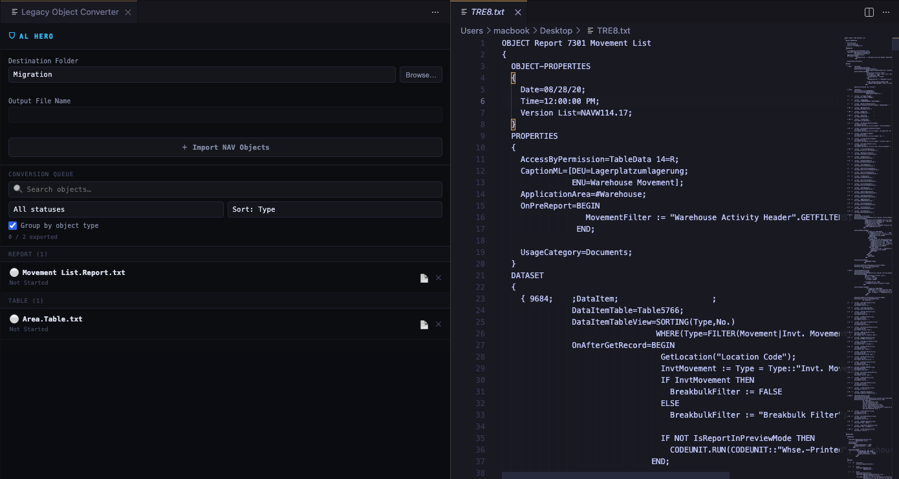

### How to Use

#### Import

1. Open the panel via the Command Palette.
2. Set the **Destination Folder** — where converted `.al` files will be written — using the **Browse** button.
3. Click **Import NAV Objects** and select one or more exported NAV `.txt` files. Multiple files can be selected in a single dialog.
4. AL HERO reads each file's `OBJECT` header to detect its type, ID, and name, and adds it to the **Conversion Queue** on the left, grouped by object type by default.

#### Convert & Review

1. Click any object in the queue. AL HERO converts it and opens the generated AL code as a normal, editable VS Code tab in a wide column beside the queue — the same editing experience as any other `.al` file in your project.
2. Edit the code as needed: fix names, adjust types, resolve object ID conflicts, or clean up anything the conversion didn't get quite right. Compiler errors and warnings from the AL Language extension appear inline as you go, exactly like normal AL development.
3. Nothing is written to disk yet at this point — the tab shows unsaved changes, the same as creating any new file in VS Code.

#### Export

There's no separate export step or button — **saving the file is the export**.

1. Press `Ctrl+S` once the AL code looks right.
2. VS Code writes it directly into your chosen Destination Folder.
3. The object's status in the queue flips to **Exported**. You can reopen and re-save an exported object at any time — every save keeps it up to date.

#### Manage a Large Migration

Objects move through three states as you work: **Not Started** → **In Progress** (opened, not yet saved) → **Exported** (saved at least once).

- Use the **search box** to filter the queue by object name, type, or ID.
- Use the **status** and **sort** dropdowns to organise a large batch — sorting by **Type** groups Tables, Pages, Table Extensions, Page Extensions, Codeunits, Reports, XMLPorts, Queries, Enums, and other object types together, so you can migrate one object type at a time.
- Each queued object has two quick actions: **📄 Open Original TXT** (opens the source NAV export beside your AL editor for side-by-side comparison, without permanently splitting your layout) and **✕ Remove from Queue** (stops tracking the object — it never deletes a file you've already saved).
- Exported objects stay visible in the queue rather than disappearing, so a multi-session migration across hundreds of objects stays easy to track.

### Features at a Glance

- **Multi-file import** — bring in several NAV `.txt` exports in one go.
- **Automatic object detection** — each file's object type, ID, and name are parsed straight from its `OBJECT` header, no manual tagging.
- **Grouped, searchable, sortable queue** — built to stay usable across large NAV-to-Business-Central migrations, not just a handful of objects.
- **Real AL editing, not a custom preview** — every converted object opens as an actual `.al` file, so you get the full AL Language extension experience: syntax highlighting, IntelliSense, formatting, and live diagnostics.
- **Save-to-export workflow** — no separate export dialog; saving the file is exporting it, the same muscle memory as everything else you do in VS Code.
- **Compare with the source** — jump back to the original C/AL export at any time with one click.
- **Session-persistent queue** — objects and their status remain in the queue after export, ready to pick back up in a later session.

---

## Getting Started

1. Install **AL HERO** from the Visual Studio Marketplace.
2. Open a Business Central AL workspace in VS Code.
3. Open the **Command Palette** (`Ctrl+Shift+P`) and type `AL HERO` to see all available tools.
4. Start from the **Dashboard** for a quick overview of your project, or jump straight into any tool from the Command Palette.
5. For API-related features, open **API Explorer** and configure your connection credentials via the **⚙ Connection Settings** dialog before sending requests.
6. Migrating from NAV? Open the **Legacy Object Converter**, set a destination folder, and import your exported C/AL `.txt` files to get started.

---

## Tips & Shortcuts

| Shortcut | Action |
|---|---|
| `Ctrl+Enter` | Send request (API Explorer) / Add object to queue (AL Object Creator) |
| `Ctrl+S` | Export the currently open object (Legacy Object Converter) |
| `Escape` | Close modal dialogs / Discard inline translation edit |
| `Ctrl+Shift+P` → `AL HERO` | Open any AL HERO tool from the Command Palette |

- **Rescan buttons** (↺) are available in the API Explorer, Translation Assistant, Browse Project Symbols, and AL Object Creator to refresh workspace data without closing and reopening a panel.
- All AL HERO panels share a consistent dark theme, layout, and keyboard patterns — once you learn one, the others feel immediately familiar.
- In the **API Explorer**, the `company` parameter is automatically pinned to the top of the params table and displayed with a distinct accent style so it's never accidentally removed.
- In the **Translation Assistant**, auto-save is silent by default — the VS Code panel only shows a notification for batch operations, not for individual inline edits, keeping your workflow uninterrupted.
- In the **Legacy Object Converter**, there's no separate export button to remember — if you've saved the AL file, it's exported.
- Start every session from the **Dashboard** to get a quick health check of your workspace before diving into a specific tool.

---

## Marketplace

AL HERO is available on the [Visual Studio Marketplace](https://marketplace.visualstudio.com/items?itemName=yahyatouil.bc-hero). Search for **AL HERO** or install directly from the Extensions view in VS Code (`Ctrl+Shift+X`).

---

### **Contributing**

While **pull requests (PRs)** are not currently being accepted, **feedback** is always welcome. If you have ideas for new features or encounter any bugs, feel free to open an **issue** or submit a **feature request**.

To submit feedback:

1. Visit the [GitHub Issues page](https://github.com/yahyatouil-dev/bc-hero-info/issues).
2. Open a new issue with details about the problem or your feature request.

Your input helps improve AL HERO, and we appreciate any contributions you make!

---

### **License Information**

This extension is released under the **Apache License 2.0**. You can freely use, modify, and distribute this software, with some conditions. See the full license text [here](http://www.apache.org/licenses/LICENSE-2.0).

---

### **Feedback & Support**

If you encounter any issues or have questions, don't hesitate to [open an issue](https://github.com/yahyatouil-dev/bc-hero-info/issues). You can also reach out to the community for support or offer suggestions for new features.

---

### **Stay Updated**

Follow us on GitHub or the **Visual Studio Marketplace** to get the latest updates and announcements about AL HERO. As always, more features are in the pipeline to make your BC development experience even better.

---
## **Powered by Love ❤️**
Made with ❤️ by **Yahya Touil**.

Check out my blog for more insights, tutorials, and updates on Business Central and AL development: [Yahya's Blog](https://yahyatouil.com).

Thank you for supporting **AL HERO** — your feedback and feature requests are always appreciated!
---

*AL HERO — Built for Business Central AL developers.*
